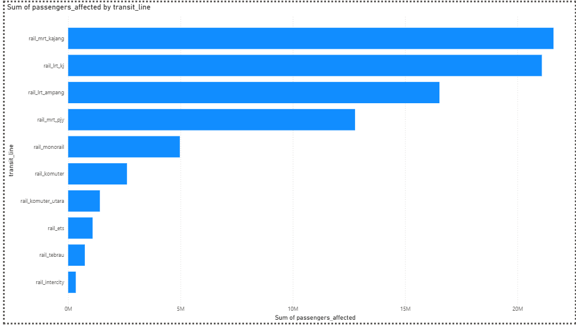

# Klang-valley-urban-mobility-risk

An end-to-end ETL pipeline translating raw Malaysian public transit data into executive economic loss intelligence using Python, SQLite, and Power BI. 

# Klang Valley Urban Mobility Risk Index

An end-to-end data engineering pipeline translating raw Malaysian public transit ridership data (2024–2026) into executive-ready economic loss intelligence.

## Business Problem & Impact
* **The Bottleneck:** Government transit data from data.gov.my arrives raw and un-contextualized, requiring consulting teams to spend 10+ hours weekly manually cleaning spreadsheets.
* **The Solution:** Automated the entire ingestion and modeling framework, saving ~10 hours of manual labor per week and providing immediate ministerial-ready insight.
* **The Metric:** Translated raw passenger delays into a **Simulated Economic Loss Index (MYR)**, revealing a macroeconomic risk concentration on the MRT Kajang and LRT Kelana Jaya lines.

## System Architecture
1. **Ingest & Clean (Python/Pandas):** Automated schema mapping, data melting, and typecasting on 8,820 records from the Prasarana ridership API.
2. **Analytics Warehouse (SQLite):** Developed a decoupled database schema separating operational records from an adjustable parameters table (`cfg_transit_parameters`) to prevent hardcoded variables.
3. **Executive Visualization (Power BI):** Built a high-level operational risk cockpit mapping out financial implications across 10 major rail lines.

##  Technical Stack
* **Language/Libraries:** Python 3.x, Pandas, SQLite3
* **Database Engine:** SQLite (Relational Views, Config tables, Inner Joins)
* **BI Tooling:** Power BI Desktop (DAX Measures, Data Modeling)

## Repository Structure
* `/scripts`: Core Python processing scripts.
* `/sql`: Database build queries and operational summary views.
* `/dashboard`: Production `.pbix` template.
* `/documentation`: Executive portfolio presentation deck.
